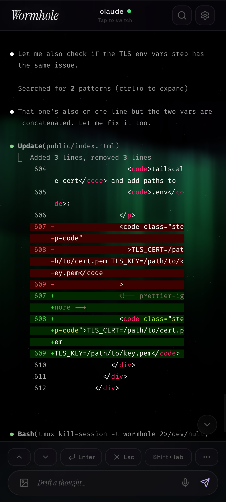

# Wormhole

A mobile terminal client with Claude Code superpowers.

<p align="center">
  
</p>

Wormhole turns your phone into a remote for your terminal. Dictate commands,
snap photos, hear responses read aloud — all streamed live over your network.
When it detects Claude Code, it unlocks a tailored mobile experience with
context-aware controls and a command palette.

## How it works

Wormhole runs a lightweight server on your machine that connects to tmux. It
streams terminal output to your phone's browser via WebSocket and sends your
input back — giving you the mic, speakers, and camera that a terminal doesn't
have.

```
Phone Browser ----> Wormhole Server ----> tmux ----> Claude Code
      ^                   |
      +--- WebSocket <----+
```

## Features

- **Voice** — dictate prompts, hear responses read aloud (full or summary mode)
- **Images** — attach from camera or gallery, multiple at once
- **Live terminal** — ANSI colors, auto-scroll, output search
- **Multi-session** — switch between tmux sessions, create and delete from the
  app
- **Context-aware keys** — Claude Code layout (Shift+Tab, Ctrl+O, Ctrl+C) vs
  terminal layout (Home, End, PgUp, PgDn, sticky Ctrl/Alt/Shift modifiers)
- **Snippets** — save and recall commands from a palette
- **Password vault** — encrypted credential storage with terminal paste and
  remote clipboard injection ([security details](docs/VAULT.md))
- **Themes** — animated GLSL shader backgrounds (Starry Night, Aurora, Nebula,
  Topography)
- **Customizable** — accent color, TTS voice/speed, terminal column width

## Quick start

```sh
curl -sL https://raw.githubusercontent.com/cszach/wormhole/main/install.sh | sh
cd wormhole
npm run dev
```

Open `http://<your-ip>:5173` on your phone. You can create and switch between
tmux sessions from the session picker in the header.

### HTTPS (required for voice dictation)

The Web Speech API requires a secure context. If you use Tailscale, you can get
a free TLS certificate:

```sh
sudo tailscale cert \
  --cert-file ~/.local/share/tailscale/cert.pem \
  --key-file ~/.local/share/tailscale/key.pem \
  <hostname>.<tailnet>.ts.net
```

Then add the paths to your `.env`:

```
TLS_CERT=/home/you/.local/share/tailscale/cert.pem
TLS_KEY=/home/you/.local/share/tailscale/key.pem
```

## Configuration

All configuration is via a `.env` file in the project root. Available variables:

| Variable     | Default     | Description             |
| ------------ | ----------- | ----------------------- |
| `PORT`       | `5173`      | Server port             |
| `UPLOAD_DIR` | `./uploads` | Image upload directory  |
| `TLS_CERT`   |             | Path to TLS certificate |
| `TLS_KEY`    |             | Path to TLS private key |

## Testing

```sh
npm test
```
